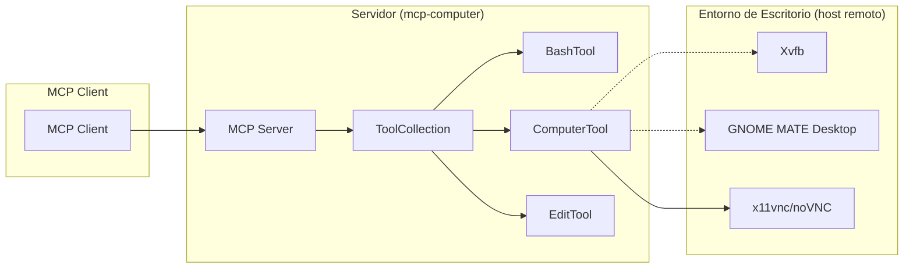

# Fase 1: Auditoría de funcionalidades existentes

## Objetivos
- Identificar y documentar todas las funcionalidades presentes en la demo de uso de ordenador.
- Obtener un inventario de herramientas, interfaces y scripts.
- Visualizar de forma esquemática la arquitectura actual.

---

## Metodología
1. Revisión del bucle de agente (`computer_use_demo/loop.py`).
2. Inspección de las herramientas definidas en `computer_use_demo/tools/`.
3. Revisión del entorno de escritorio y servicios VNC/noVNC en el sistema remoto.
4. Estudio del contenedor Docker y scripts de arranque (Xvfb, tint2, mutter, x11vnc, noVNC).
5. Recopilación del conjunto de pruebas (`tests/`) y valoración de la cobertura.

---

## Hallazgos

### 1. Bucle de agente (`loop.py`)
- Ejecuta peticiones a la API (Anthropic, Bedrock o Vertex).
- Maneja el prompt del sistema y extensiones beta (caché, herramientas token-eficientes).
- Itera recibiendo bloques de texto y "tool_use" para invocar herramientas.
- Inserta resultados de herramientas de vuelta en la conversación.
- Control de recorte de imágenes y cache-breakpoints.

### 2. Herramientas en `computer_use_demo/tools/`
- **BashTool**  
  - Ejecuta comandos en una sesión persistente de Bash.  
  - Parámetros: `command`, `restart`.  
  - Soporta reinicio de sesión, timeouts, errores.
- **ComputerTool**  
  - Interacción gráfica: mover ratón, clic (simple, doble, arrastre), teclado (key, type), captura de pantalla, posición de cursor.  
  - Soporta escalado de coordenadas y screenshots con `xdotool`, `scrot` o `gnome-screenshot`.
- **EditTool**  
  - Editor de ficheros: `view`, `create`, `str_replace`, `insert`, `undo_edit`.  
  - Implementa validación de rutas, rangos de visualización, historial de versiones.

### 3. Contenedor Docker y scripts
- **Dockerfile**:  
  - Base Ubuntu 22.04, instalaciones de dependencias GUI, X11, Python (Pyenv), aplicaciones de escritorio, VNC y noVNC.  
  - Copia código y configura `entrypoint.sh`.  
- **Scripts de arranque** (`image/*.sh`):  
  - `start_all.sh`: Xvfb, tint2, mutter, x11vnc.  
  - `xvfb_startup.sh`: lanza X virtual con resolución.  
  - `tint2_startup.sh`: inicia panel.  
  - `mutter_startup.sh`: inicia gestor de ventanas.  
  - `x11vnc_startup.sh`: servidor VNC y monitorización.  
  - `novnc_startup.sh`: proxy WebSocket para noVNC.  
  - `http_server.py`: servidor estático HTTP en el puerto 8080.  
  - `entrypoint.sh`: orquesta arranque de todos los servicios de escritorio y VNC/noVNC.

### 4. Conjunto de pruebas (`tests/`)
- **`tests/loop_test.py`**: verifica flujo de mensajes, invocación de herramientas y callbacks.
- **`tests/tools/bash_test.py`**: cubre reinicio, ejecución, errores y timeouts de BashTool.
- **`tests/tools/computer_test.py`**: cubre acciones de ratón, teclado, captura y escalado.  
- **`tests/tools/edit_test.py`**: cubre comandos de edición (view, create, str_replace, insert, undo) y validaciones de ruta.  
- **Cobertura**: alta en herramientas y loop; interfaz y scripts de Docker no están automatizados.

---

## Diagrama de alto nivel

---

**Próximos pasos**  
- Validar si se requiere ampliar pruebas o documentar aún más detalles de scripts.  
- Preparar entregable FASE_2.md con el estudio del protocolo MCP. 