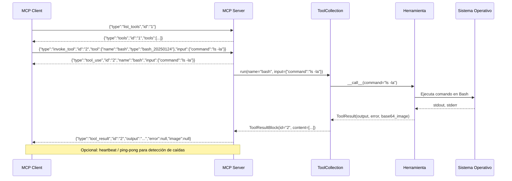

# Fase 2: Diagrama de Secuencia de Flujos MCP

Este diagrama muestra la secuencia completa de interacciones entre un Cliente MCP, el Servidor MCP, la Colección de Herramientas, cada Herramienta concreta y el Sistema Operativo remoto.

